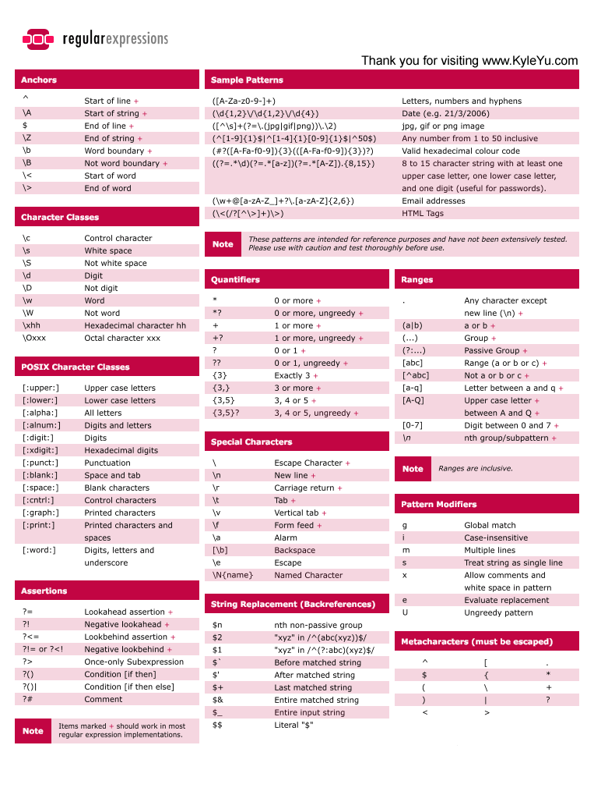

# Vim


##  Konfiguracja

### .vimrc
Możemy sami konfigurować vima wedle naszych upodobań, poniżej mamy dwa
przykłady:

* [.vimrc
  podstawowy](https://raw.githubusercontent.com/project2051/vim-workshop/master/vimrc.basic)

* [.vimrc bardziej
  zaawansowany](https://raw.githubusercontent.com/project2051/vim-workshop/master/vimrc.improved)

### Super extra mega pluginy
Jednak na czas tutorialu prosiłbym o zainstalowanie [janusa](https://github.com/carlhuda/janus)

ja dodatkowo instaluje sobie temacik monokai

`git clone https://github.com/sickill/vim-monokai ~/.janus/`


## O co loto?
Na vim trzeba patrzeć jak na jezyk, podstawą jest poznanie normal mode,
gdyż większość czasu właśnie w nim się spędza.

# Motion
Wyedytujmy pierwszy plik `vim 1`

Tutaj poznamy zakres ruchów jakie możemy robić w vim'ie

<kbd>M</kbd> - środek ekranu

<kbd>h</kbd> - kursor w lewo

<kbd>j</kbd> - kursor w dol

<kbd>k</kbd> - kursor do gory

<kbd>l</kbd> - kursor w prawo

<kbd>L</kbd> - koniec ekranu

<kbd>H</kbd> - początek ekranu

<kbd>{</kbd> - początek/poprzedni akapit

<kbd>}</kbd> - koniec/następny akapit

<kbd>(</kbd> - początek/poprzednie zdanie

<kbd>)</kbd> - koniec/następne zdanie

<kbd>w</kbd> <kbd>W</kbd> - następne słowo / SŁOWO

<kbd>b</kbd> <kbd>B</kbd> - poprzednie słowo / SŁOWO

<kbd>e</kbd> <kbd>E</kbd> - koniec słowa / SŁOWA

<kbd>g</kbd><kbd>e</kbd> - koniec poprzedniego słowa

<kbd>*</kbd> - następne słowo pod kursorem

<kbd>#</kbd> - poprzednie słowo pod kursorem

<kbd>0</kbd> - początek linijki

<kbd>^</kbd> - początek tekstu w linijce

<kbd>$</kbd> - koniec linijki

<kbd>G</kbd> - koniec pliku

<kbd>g</kbd><kbd>g</kbd> - początek pliku

<kbd>:</kbd><kbd>q</kbd> - wyjście bez zapisu jeśli nie było zmian

<kbd>:</kbd><kbd>q</kbd><kbd>!</kbd> - wyjście bez zapisu

<kbd>:</kbd><kbd>w</kbd><kbd>q</kbd> - wyjście z zapisem

<kbd>Z</kbd><kbd>Q</kbd> - wyjście bez zapisu

<kbd>Z</kbd><kbd>Z</kbd>- wyjście z zapisem

Spróbujmy nawigować po kodzie i wykorzystajmy wszystkie powyższe komendy
`vim 2`

<kbd>g</kbd><kbd>g</kbd>

<kbd>1</kbd><kbd>3</kbd><kbd>g</kbd><kbd>g</kbd>

<kbd>*</kbd>

<kbd>*</kbd>

<kbd>w</kbd>

<kbd>3</kbd><kbd>*</kbd>

<kbd>G</kbd>

<kbd>4</kbd><kbd>0</kbd><kbd>g</kbd><kbd>g</kbd>

<kbd>#</kbd>

<kbd>2</kbd><kbd>(</kbd>

<kbd>M</kbd>

<kbd>{</kbd>

<kbd>}</kbd>

<kbd>{</kbd>

<kbd>{</kbd>

<kbd>L</kbd>

<kbd>1</kbd><kbd>0</kbd><kbd>B</kbd>

<kbd>1</kbd><kbd>0</kbd><kbd>k</kbd>

<kbd>3</kbd><kbd>l</kbd>

<kbd>6</kbd><kbd>k</kbd>

<kbd>1</kbd><kbd>5</kbd><kbd>E</kbd>

<kbd>e</kbd>

<kbd>2</kbd><kbd>#</kbd>

etc etc etc

akcja w vimie poprzedzona liczbą zostanie powtórzona odpowiednią ilość
razy np:

<kbd>1</kbd><kbd>0</kbd><kbd>j</kbd> - dziesięć linijek w dół

<kbd>1</kbd><kbd>0</kbd><kbd>k</kbd> - dziesięć linijek w górę

<kbd>2</kbd><kbd>l</kbd> - dwa znaki w prawo

<kbd>7</kbd><kbd>h</kbd> - siedem znaków w lewo

<kbd>4</kbd><kbd>w</kbd> - czwarte słowo

<kbd>5</kbd><kbd>E</kbd> - koniec piątego SŁOWA

<kbd>3</kbd><kbd>}</kbd> - koniec trzeciego akapitu

ale

<kbd>1</kbd><kbd>2</kbd><kbd>g</kbd><kbd>g</kbd> - przeniesie kursor do odpowiedniej linijki

## Operatory
<kbd>y</kbd> - kopiuj

<kbd>d</kbd> - wytnij do rejestru

<kbd>c</kbd> - change

<kbd><</kbd> - indent w lewo

<kbd>></kbd> - indent w prawo

powielenie operatora spowoduje wykonanie go na danej linijce

<kbd>y</kbd><kbd>y</kbd> - kopiuj linjke

<kbd>d</kbd><kbd>d</kbd> - usun linjke

etc

Zaraz po operatorze używamy motion mówimy co chcemy zrobić np:

<kbd>c</kbd><kbd>w</kbd> - zamień słowo

<kbd>d</kbd><kbd>1</kbd><kbd>0</kbd><kbd>g</kbd><kbd>g</kbd> - usuń wszystko od tej linijki do 10

<kbd>y</kbd><kbd>G</kbd> - kopiuj wszystkie linjki stąd do końca pliku

<kbd>d</kbd><kbd>$</kbd> - usuń znaki od kursora do końca linijki

## Commands
Komenda różni się od operatora, że nie potrzebuje modyfikatora zaraz za
nią

<kbd>i</kbd> - wbija w tryb insert

<kbd>R</kbd> - wbija w tryb replace

<kbd>x</kbd> - usuwa znak (delete)

<kbd>X</kbd> - usuwa znak poprzedni (backspace)

<kbd>I</kbd> - insert na początku linii (^i)

<kbd>S</kbd> - kasuje linijkę i wbija w insert (ddi)

<kbd>s</kbd> - kasuje znak i wbija w insert (xi)

<kbd>A</kbd> - idzie na koniec linijki i wbija w tryb insert ($i)

<kbd>a</kbd> - znak w prawo i insert (li)

<kbd>p</kbd> - wstawia z bufora linijke niżej

<kbd>P</kbd> - wstawia z bufora linijke wyżej

<kbd>o</kbd> - nowa linijka poniżej

<kbd>O</kbd> - nowa linijka powyżej

<kbd>u</kbd> - undo

Naciskając <kbd>d</kbd> vim poczeka na motion, naciskając <kbd>x</kbd> usunie od razu jeden
znak.

`vim 3`

Możemy wykorzystać naszą wiedzę i zacząć walić kombosy!

Chcemy zmienić słowo Python na np: Java, jest na to wiele

sposobów spróbujemy różnych ucząc sie przy tym kolejnych vimowym zwrotów

<kbd>f</kbd><kbd>P</kbd><kbd>R</kbd>`Java`<kbd>Del</kbd><kbd>Del</kbd><kbd>Esc</kbd>

po każdym wykonaniu komend można przywrócić stan pliku z początku
komendą `:e!` lub komendą <kbd>u</kbd> (undo)

<kbd>5</kbd><kbd>e</kbd><kbd>c</kbd><kbd>w</kbd>`Java`<kbd>Esc</kbd>

<kbd>4</kbd><kbd>w</kbd><kbd>d</kbd><kbd>w</kbd><kbd>i</kbd>`Java`<kbd>Esc</kbd>

<kbd>}</kbd><kbd>d</kbd><kbd>b</kbd><kbd>i</kbd>`Java`<kbd>Esc</kbd>

<kbd>f</kbd><kbd>!</kbd><kbd>d</kbd><kbd>b</kbd><kbd>i</kbd>`Java`<kbd>Esc</kbd>

<kbd>2</kbd><kbd>9</kbd><kbd>l</kbd><kbd>6</kbd><kbd>x</kbd><kbd>i</kbd>`Java`<kbd>Esc</kbd>

Przywrócmy stan pierwotny `:e!`

<kbd>y</kbd><kbd>y</kbd><kbd>3</kbd><kbd>p</kbd> - skopiuje linijke i powieli ją poniżej 3 razy

<kbd>d</kbd><kbd>3</kbd><kbd>d</kbd> - przesunie 3 linijki do nienazwanego rejestru

<kbd>p</kbd> - wklei zawartość nienazwanego rejestru

<kbd>.</kbd> - powtórzy poprzednią akcję czyli `p`

Jeśli wcześniej nie było takiego kontaktu z vimem to faktycznie może to
być dużo do przyjęcia na raz, ale warto zawsze wrócić do podstaw i
przypomnieć sobie jak być bardziej produktywnym i korzystać z całego
słownika językowego vima.

Na końcu tego READme są linki do innych tutoriali/ćwiczeń, gorąco
polecam. Janusz TouK

## Vim jako IDE

Na początek sklonujmy sobie repo z githuba

```
git clone https://github.com/TouK/sputnik /tmp/sputnik
cd /tmp/sputnik
vim -p *
```

### Taby
Vim otworzył nam siedem zakładeczek, jeśli nie macie żadnych bindingów
to

<kbd>ctrl</kbd><kbd>alt</kbd><kbd>pgup</kbd>

<kbd>ctrl</kbd><kbd>alt</kbd><kbd>pgdown</kbd>

pozwoli nam poruszać się miedzy zakładkami. Ja korzystam z tego tak, że
w każdej mam inny projekt, a pliki które edytujemy w każdej z nich
znajdują się w buforze. Choć raczej korzystam z fuzzy search'a ;)

### Bufory
<kbd>:ls</kbd>

Pokazuje pliki które są w pamięci, można się przełączać między nimi
korzystając z np:

<kbd>:b4</kbd>

gdzie 4 to unikalny identyfikator bufora.

Możemy też skorzystać z pluginu który wyświetla bufory trochę ładniej

<kbd>,</kbd><kbd>b</kbd> 

### Fuzzy search
Mój ulubiony skrót to

<kbd>ctrl</kbd><kbd>p</kbd>

po jego wciśnięciu uzyskujemy dodatkowe okno w którym możemy
szukać plików w danym katalogu. Np:

<kbd>srjpeviscrps</kbd>

znajdzie nam kilka plików schowanych głęboko w strukturze katalogów.
Oczywiście sposobów na znalezienie plików korzystając z wyszukiwania
rozmytego jest sporo


### Git
Doskonały plugin fugitive umożliwia nam commitowanie zmian i pushowanie
ich od razu do repozytorium. Janus binduje je jako

<kbd>,</kbd><kbd>g</kbd><kbd>s</kbd> - tutaj <kbd>-</kbd> zaznacza nam co chcemy
commitować

<kbd>,</kbd><kbd>g</kbd><kbd>c</kbd> - commit

<kbd>,</kbd><kbd>g</kbd><kbd>p</kbd> - push it

### Code snippets
[snippets](https://github.com/honza/vim-snippets/tree/master/snippets)

Będąc w kodzie javy możemy napisać `main` i naciskając <kbd>tab</kbd>
rozwinie się to nam do pełnego snippetu. `cl`, `in`, `co`, `d.hs` etc
etc. Jest ich pełno, a dodanie swojego jest bjest bajecznie proste ;)

[VIM as IDE](http://vim.wikia.com/wiki/Use_Vim_like_an_IDE)

## SED

Najpierw krótkie przypomnienie z wyrażeń regularnych:



Żeby skorzystać z wyrażeń regularnych wbijamy do trybu command
naciskając

<kbd>:</kbd>

<kbd>:s</kbd> mówi że będziemy chcieli podmieniać

<kbd>:s/Python/Java</kbd> zamieni w bieżącej linijce słowo python na java

Między <kbd>:</kbd> i <kbd>s</kbd> możemy wstawiać modyfikatory:

* <kbd>:1,3s</kbd> od pierwszej do trzeciej linijki

* <kbd>:.,$s</kbd> od bieżącej linijki do końca pliku

* <kbd>:.,+7s</kbd> od bieżącej linijki

* <kbd>:%s</kbd>  w całym pliku

* <kbd>:g/^baz/s/foo/bar/</kbd> szuka słowa baz i zamienia foo na bar

* i jeszcze trochę innych [s & r](http://vim.wikia.com/wiki/Search_and_replace)

Jeśli tak się składa, że szukacie lub zamieniacie na coś co ma `/` to
możecie użyć innego rozdzielnika np <kbd>!</kbd> lub <kbd>#</kbd>

## Dodatkowe pomoce

[vim.wikia](http://vim.wikia.com/wiki/Tutorial)

[search patterns](http://vim.wikia.com/wiki/Search_patterns)

[vim-adventures](http://vim-adventures.com/)

[shortcutfoo](https://www.shortcutfoo.com/app/dojos/vim)
